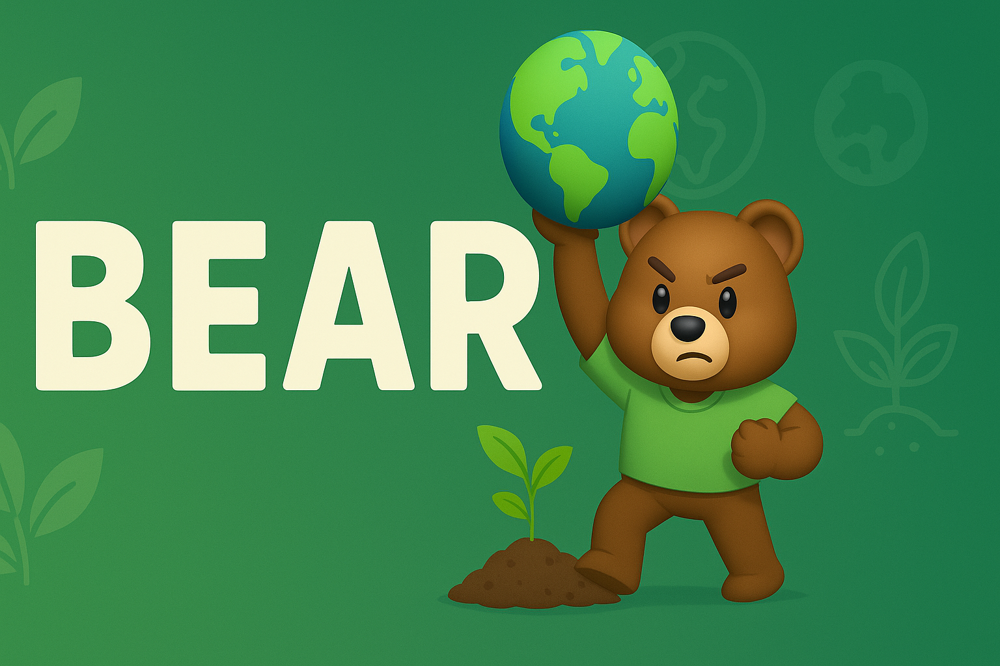

<p align="center">
  
</p>

<h1 align="center">BEARS 🐻</h1>
<h3 align="center">Baylor Environmental Agents for Research Sustainability</h3>

<p align="center">
  <strong>AI-powered agents working to model, simulate, and fight climate change.</strong>
</p>

---

## 🌍 Overview

**BEARS** is a research initiative focused on building intelligent, agent-based simulations to support sustainability, resilience, and environmental education. The system leverages reinforcement learning, simulation environments, and real-world datasets to explore interventions in:

- Climate impact modeling
- Environmental resource management
- Sustainable behavior simulation
- Ecosystem protection strategies

---

## 🧠 Core Features

- **Agent-Based Simulation:** Modular agents with dynamic decision-making.
- **Climate Scenario Modeling:** Test mitigation strategies under varied environmental stressors.
- **Explainable AI:** Visual and traceable behavior paths for each agent.
- **Open Collaboration:** Built to support research, education, and policy prototyping.

---

## Requirments and Running
1. please create a venv and install the required libs
```bash
pip install -r requirements.txt
```
2. Run each .ipynb file in ./src file sequentially.
3. All the middle result .json file are in the ./output folder.
4. The final 3 generated report are in ./output/report folder.